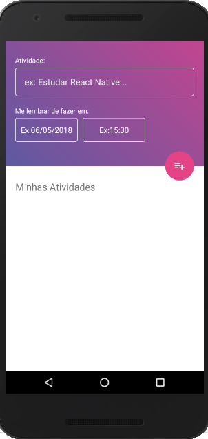

# ToDoListApp
Agenda de tarefas mobile

## Funcionalidades:

* Listagem de tarefas.
* Inclusão de novas tarefas com data e hora e título.
* Edição das tarefas.
* Exclusão de tarefas.

## Validações:

* Não é permitido salvar com campos vazios.

## Campos:

* Atividade
* Data
* Hora

## Linguagem 

* JavaScript

## Biblioteca

* React

## Framework

 * React Native

## Execução

### Requisitos
 * Node.js
``npm install``

 * React-Native
``npm install -g react-native-cli``

 * Watchman
``npm install watchman``
 * [android studio](https://developer.android.com/studio/install?hl=pt-br)

 * [Xcode](https://developer.apple.com/xcode/)

### Configuração ambiente MacOs
 
1. No terminal abra a pasta server dentro da raiz do projeto. E execute:
2. ``npm install`` para instalação das dependências.
3. ``npm start`` para rodar o serviço.
4. ``react-native run-ios``  para iniciar o emulador ios.
5. ``react-native run-android``  para iniciar o emulador android.

 ### Se tudo der certo, ao acessar você deve ver a seguinte tela:
 
 
 ### Nas [Issues](https://github.com/AriadniAdi/ToDoListApp/issues) voce encontra algumas ideias de melhoria que não tive tempo de desenvolver.
